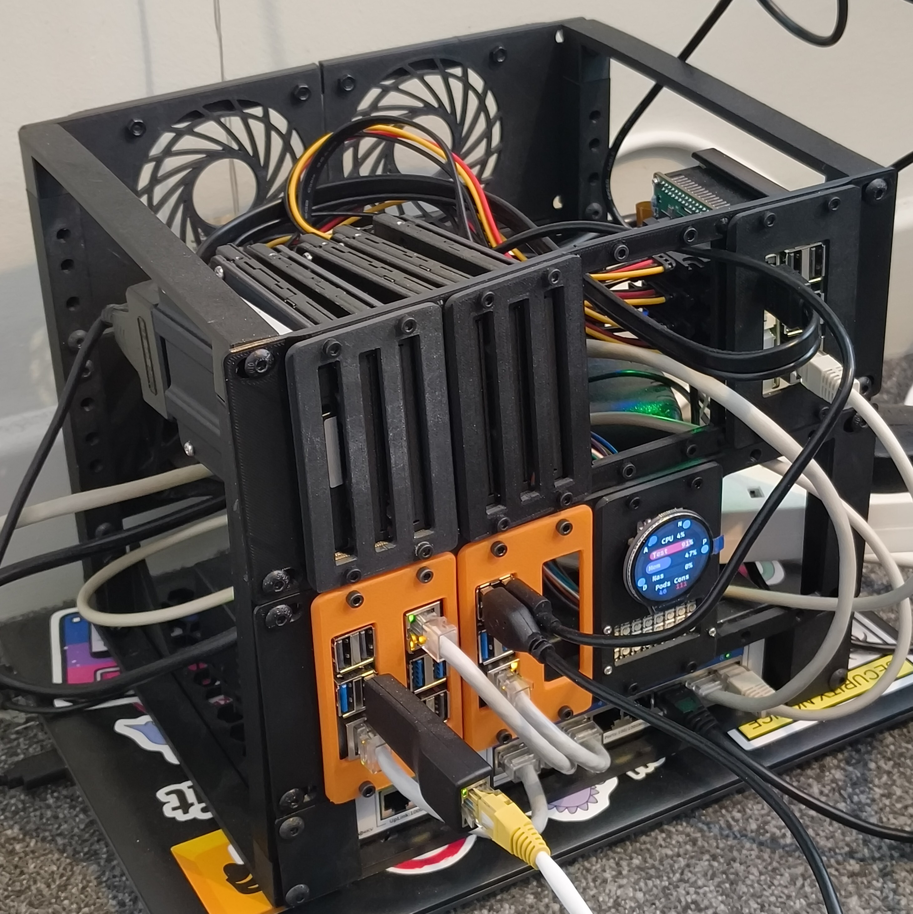

# Nexus

Nexus is my Kubernetes cluster deployed through GitOps by FluxCD.

Deployed on 3 Raspberry Pi 5s and 1 x86_64 node, the aim is to emulate a real
world Kubernetes cluster using free and open source solutions built for
enterprise environments.

I use the apps deployed in this cluster every single day, so it is completely
battle tested, and truly is running in production.

# Infrastructure

- **SOPS** for secret management
- **Traefik** for ingress
- **PostgreSQL** for a database
- **Valkey** as a **Redis** replacement
- **NFS** mounts from a Raspberry Pi 5 **NAS** for persistent storage
- **Renovate** for automatic PR based image updates

# Monitoring

- **Kube Prometheus Stack** for **Prometheus** and **Grafana**
- **Whoami** and **IPerf3** for network and reverse proxy testing

